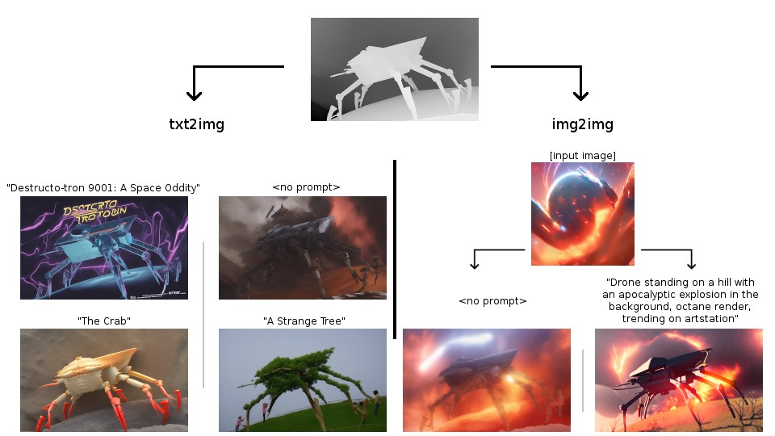
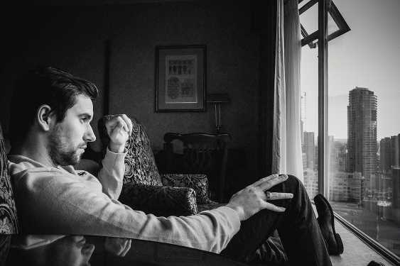
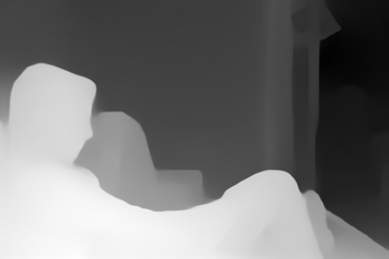

# Depth Image I/O for stable-diffusion-webui
An extension to allow managing custom depth inputs to Stable Diffusion depth2img models for the stable-diffusion-webui repo.

For instance an artist may wish to use depth data rendered from a model made in a 3D rendering suite (Blender, Maya, etc.) and have Stable Diffusion "render" the scene, or one may wish to take the MiDaS-estimated depth (that the vanilla depth2img pipeline uses) of one image and combine it with the colour-information from another.

Here are some examples taking depth data from an old 3D model of mine:

This code is somewhat fragile at present because the manner in which stable-diffusion-webui handles depth2img models is not currently exposed usefully; accordingly for now this extension monkeypatches some behaviour (although in a manner which should be totally-harmless when the extension's script is not active).

**Aside:** An 8-bit-depth greyscale image might seem like a potentially-insfuccient data format for linear depth data, but for reasons it seems to suffice here in practice. I say this because of the following:

Firstly, the model is used to estimated depth fields from MiDaS which tend to put most of their variation of values within a relatively small range that makes visual-but-not-physical sense, and/or be somewhat compositionally aware of what's "background" and often more-or-less ignore it, for instance:

 

Note that MiDaS **A)** decides the skyscrapers are small blocks just outside his window, and **B)** seemingly hand-waves all the furniture at the back of the room as 'unimportant'. This is the sort of data the Stable Diffusion 2.0 depth2img model was trained to reproduce images from.

Accordingly, one will find that attempting to give realistic linear depth values for the skyscrapers would produce bad results (de-facto, obliterating the model's sense of everything in the room as it is compressed to a relatively tiny range), and one should expect Stable Diffusion to "fill in"/"hallucinate" objects on vague background-ish swathes of depth like the back room wall here.

Additionaly, for the model this is designed for, the depth is downsampled to 1/8th the target dimensions (so 64x64 for 512x512) and normalized to a [-1.0, 1.0] range, and the model does not seem particularly sensitive to very fine differences in the depth values; the lack of precision from having only 255 possible depth values doesn't seem to have much any effect in a handful of casual tests (I had tried to support floating-point depth values in an OpenEXR format at first; it doesn't seem worth it).

(A strange upshot of all this is that it seems that whether a depth image "looks" correct at a glance can seemingly matter much more than whether it "is" physically correct! I've even thrown the linearity of the depth out the window in some few of my tests (e.g. used logarithmic depth) and it never seemed to hurt much so long as it looked "sort of like what MiDaS outputs" to my eyeballs.)

# Tutorial For How To Generate Epic Text By Using Depth Image I/O Extension
[How To Generate Stunning Epic Text By Stable Diffusion AI - No Photoshop - For Free - Depth-To-Image](https://www.youtube.com/watch?v=TBq1bhY8BOc)

